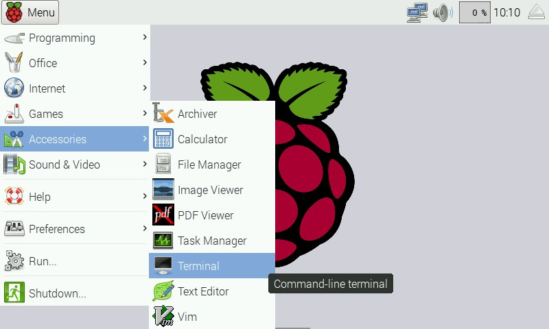

We've pulled together a great set of features into this home monitoring and automation controller. Relays, analog channels, powered outputs, and buffered inputs (all 24V tolerant) mean you can now hook up a plethora of goodies to your Raspberry Pi.

Available from Pimoroni:

* https://shop.pimoroni.com/products/automation-hat
* https://shop.pimoroni.com/products/automation-phat

Features:

* 24V @ 2A relay (NC and NO terminals)
* 3 x 12-bit ADC @ 0-24V
* 3 x 24V tolerant buffered inputs
* 3 x 24V tolerant sinking outputs
* 15 x channel indicator LEDs (HAT only)
* 1 x 12-bit ADC @ 0-3.3V (HAT only)
* 3.5mm screw terminals
* Power, Comms, and Warn! LED indicators (HAT only)
* SPI interface broken out
* Extra GPIO: TX (#14), RX (#15), #25

##Installation

**Full install ( recommended ):**

We've created a super-easy installation script that will install all pre-requisites and get your Automation HAT or pHAT up and running in a jiffy. To run it fire up Terminal which you'll find in Menu -> Accessories -> Terminal on your Raspberry Pi desktop like so:



In the new terminal window type:

```bash
curl -sS https://get.pimoroni.com/automationhat | bash
```

If you choose to download examples you'll find them in `/home/pi/Pimoroni/automationhat`.


## Documentation & Support

* Automation HAT GPIO Pinout - https://pinout.xyz/pinout/automation_hat
* Get help - http://forums.pimoroni.com/c/support

## Usage

### Analog

Three of the four analog inputs on Automation HAT are 24V tolerant, with a forth 3.3V input in the breakout header.

You can read an analog input like so:

```python
value = automationhat.analog.one.read()
```

### Inputs

The three inputs on Automation HAT are 24V tolerant, switching on at 3V and off at 1V. Behaviour at voltages between 1V and 3V is undefined.

You can read an input like so:

```python
state = automationhat.input.one.read()
```

### Outputs

The three outputs on Automation HAT are 24V tolerant, sinking outputs. That means you should connect them between your load and ground. They act like a switch down to ground, toggling your load on and off.

You can turn an output on like so:

```python
automationhat.output.one.on()
```

### Relays

The three relays on Automation HAT supply both NO (Normally Open) and NC (Normally Closed) terminals. You can use them to switch a single load, or alternate between two. The relays should be placed between the voltage supply and your load.

You can turn a relay on like so:

```python
automationhat.relay.one.on()
```

Or off:

```python
automationhat.relay.one.off()
```

Toggle it from its previous state:

```python
automationhat.relay.toggle()
```

Or write a specific value:

```python
automationhat.relay.write(1) # 1 = ON, 0 = OFF
```

### Lights

Automation HAT includes three user-controllable lights: Power, Comms and Warn. You can take control of these lights to turn them on/off or write a brightness value:

```python
automationhat.light.comms.on()
```

```python
automationhat.light.warn.off()
```

Note: lights use the same methods as relays and outputs: `on`, `off`, `toggle` and `write`.

Lights associated with Inputs, Outputs, Relays and Analog are automatic by default, but you can switch them to manual if you want. First turn off the automation:

```python
automationhat.analog.one.auto_light(False)
```

Then toggle the light:

```python
automationhat.analog.one.light.on()
automationhat.analog.one.light.off()
```

